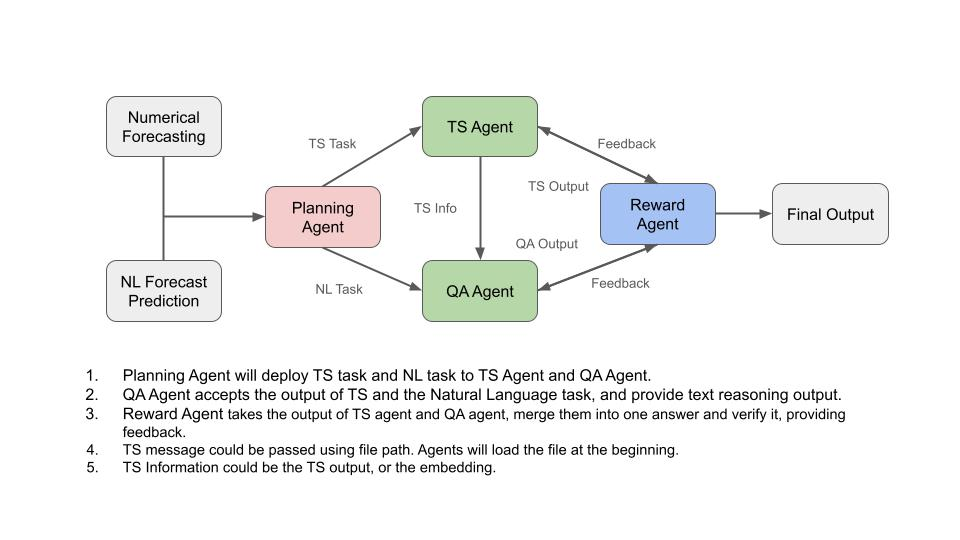

 
 # Quick Command

 ## Run the local LLM Server
 The command `CUDA_VISIBLE_DEVICES=1,2,3 uvicorn llm-server:app  --port <port number> --reload` should be run in the `multi_agents_pipeline` directory. e.g. `CUDA_VISIBLE_DEVICES=2,3,4 uvicorn llm-server:app` will run the FastAPI app on http://127.0.0.1:8000/. 

## Run the Pipeline
To execute the full pipeline, go to the `multi_agents_pipeline` folder and run `python main.py`.

> To use LLama-3-8B-Instruct, please check transformers >= 4.40! 

# Messages and Communication

```python
from pydantic import BaseModel
from typing import Optional, List


class TextMessage(BaseModel):
    """
    pass QA related message"""
    source: str
    content: str

class TSMessage(BaseModel):
    """
    passed from Planner to TS Agent, and from TS Agent to QA Agent
    
    filepath should be a valid path to a csv/tsv file""" 
    source: str
    filepath: str # TO DO : Sopport more possible types
    task_type:Optional[str] = None
    description: Optional[str] = None

class TSTaskMessage(BaseModel):
    """
    passed to Planner
    
    This message contains a text prompt and the filepath to the data file.
    """
    description: str
    filepath: str
```
| **Agent**       | **Publishes**                                         | **Subscribes**                                       |
|------------------|--------------------------------------------------------|--------------------------------------------------------|
| **Planner**       | `Planner-QA` (`TextMessage`)  <br> `Planner-TS` (`TSMessage`) | `TSTaskMessage` |
| **TS Agent**      | `TS-Info` (`TSMessage`)                              | `Planner-TS` (`TSMessage`) <br> `Reward-TS` (`TSMessage`) |
| **QA Agent**      | `QA-Response` (`TextMessage`)                        | `Planner-QA` (`TextMessage`) <br> `TS-Info` (`TSMessage`) <br> `Reward-QA` (`TextMessage`) |
| **Reward Agent**  | `Reward-QA` (`TextMessage`) <br> `Reward-TS` (`TSMessage`) | `TS-Info` (`TSMessage`) <br> `QA-Response` (`TextMessage`) |


# Agents



## Planner

Receive TSTaskMessage from user. Then generate TS Task and QA Task to be sent tox TS Agent and QA Agent. 

## TS Agent

Handle TSMessage, use Time Series Models(e.g., LTSM) or Chat Models(e.g., ChatGPT) to extract features from time series.

## QA Agent

Combine TS Info and Planner-QA, get the response of LLM, and provide 

## Reward Agent

Gather output of TS Agent and QA Agent. Send Feedback to TS and QA if the evaluation score is lower than a threshold.


